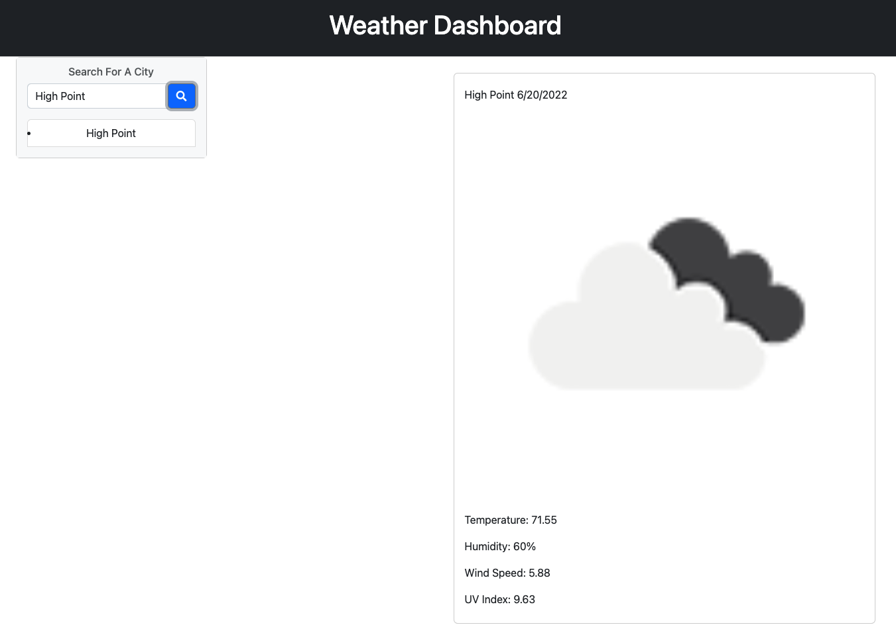
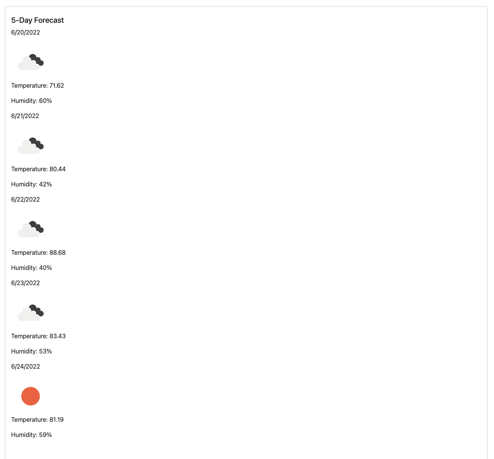

# Weather Dashboard

A weather dashboard that gives you your weather forecast for multiple cities and a 5-day forecast so that a client can prepare for a trip.

Layout and content were built using HTML, JavaScript, Bootstrap, moment.js and VS Code.

## Weather Dashboard Website

## Weather Dashboard Local Storage

## Website Function:

* You can search for multiple cities and get back the current and future conditions.

* You will be presented with the city name, the date, an icon representation of weather conditions, the temperature, humidity, the wind speed and the UV index.

## GitHub repository for Weather Dashboard
* [Github Repo](https://github.com/joliver521/weather-dashboard)

## Live website for Weather Dashboard
* [Live Work Day Scheduler Website](https://joliver521.github.io/weather-dashboard/)